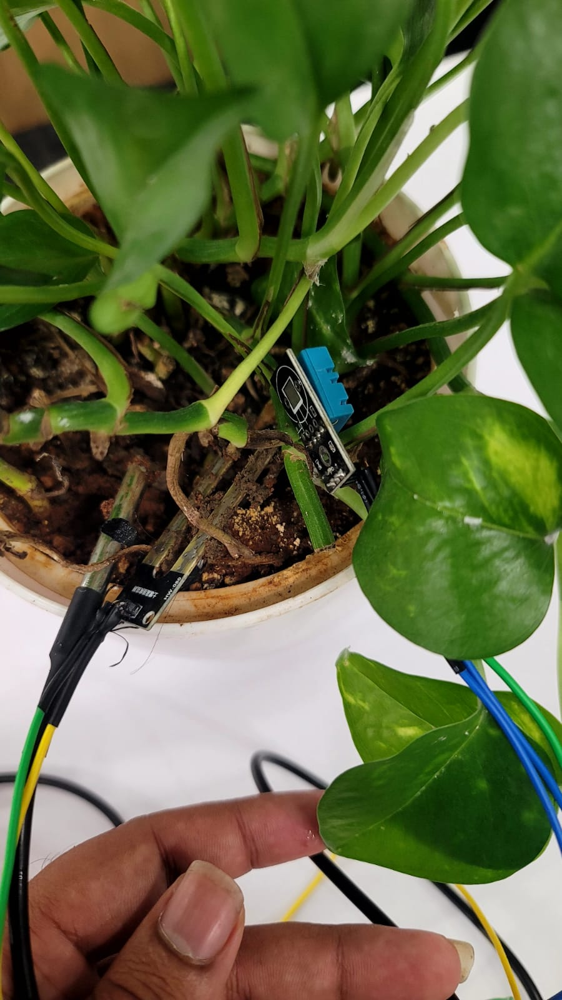
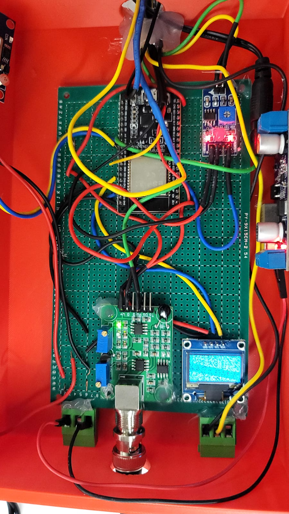
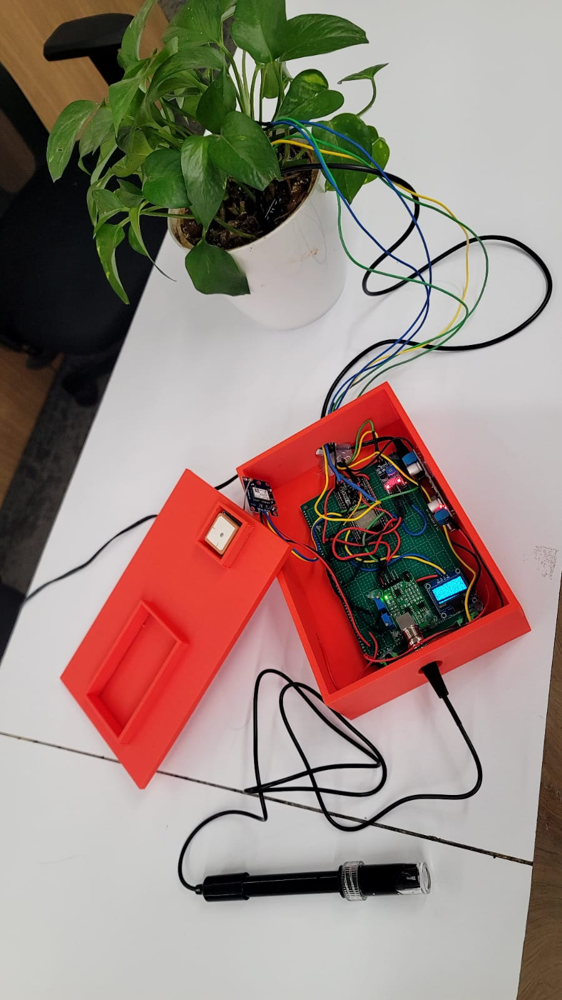
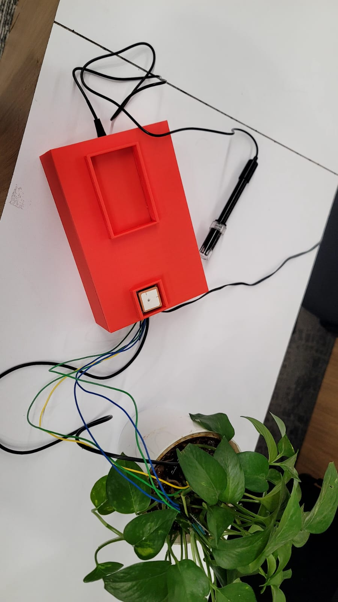

# 🌱 KisanMitra AI: The Physical AI Farming Companion

<div align="center">
  
  
  
  
</div>

<p align="center">
  <b>Bridging the gap between the physical world and artificial intelligence for modern agriculture.</b><br>
  <i>Empowering farmers with data-driven, actionable insights directly from the soil to the cloud.</i>
</p>

---

## 🏆 About This Project (Physical AI Competition)

**KisanMitra AI** is designed as a fully integrated **Physical AI** system. It demonstrates the seamless integration of physical hardware (IoT sensors and microcontrollers) with advanced artificial intelligence algorithms. Rather than just relying on software-based estimation, KisanMitra physically senses the environment in real-time—monitoring soil moisture, pH, NPK levels, and microclimate data—and uses edge-to-cloud AI pipelines to formulate precise, localized farming advisories. 

**🌐 Live Application:** [https://kisan-mitra-ai-1.vercel.app/](https://kisan-mitra-ai-1.vercel.app/)

---

## 🔥 Key Physical AI Features

KisanMitra AI brings the power of AI to the dirt and soil:

* 📡 **Continuous Physical Monitoring:** Hardware nodes equipped with Soil Moisture, DHT22, pH, and NPK sensors continually sample the physical state of the farm.
* 🤖 **Predictive AI Advisories:** Data streams are ingested by AI models to predict crop health, warn about imminent pest threats, and dictate precise irrigation schedules.
* 🗣️ **Voice-Enabled Regional Assistant (NLP):** Farmers interact with the complex data pipeline via natural language voice queries in regional languages.
* ⛅ **Hyper-Local Weather Fusion:** Combining physical sensor microclimate data with macro weather forecasting APIs for a holistic environmental understanding.
* 🔍 **Digital Crop Passport:** A verifiable, QR-based traceability ledger extending from the physical farm to the consumer's table.
* 🛒 **Direct Marketplace Integration:** Linking the physical harvest directly to buyers to eliminate middlemen.

---

## 🛠️ Comprehensive Technology Stack

Our stack represents a true edge-to-cloud Physical AI pipeline.

### 🔌 Hardware Edge (The "Physical")
* **Microcontroller:** ESP32 (Wi-Fi/Bluetooth enabled for IoT edge computing)
* **Soil Analysis:** Capacitive Soil Moisture Sensor, Soil pH Sensor, Soil NPK Sensor
* **Environment:** DHT22 (Temperature & Humidity), LDR (Light intensity)
* **Location Tracking:** GPS Module for precise geographical tagging of sensor nodes

### 🧠 Software & AI (The "AI")
* **Machine Learning:** Python-based predictive models for crop health and yield estimation
* **NLP Models:** Voice-to-text and intent recognition for regional farmer queries
* **Backend Core:** Node.js, Express, TypeScript
* **Cloud & DB:** Supabase / PostgreSQL (Relational Data), Firebase (Real-time sync)
* **Frontend:** React, Tailwind CSS, Vite (Web interface), Flutter (Mobile App)

---

## 📸 Hardware Setup & Prototyping

Our physical sensor nodes are being actively prototyped and tested. Below are our ESP32-based sensory hubs, featuring custom 3D-printed enclosures for environmental protection:

<div align="center">
  
  
</div>
<div align="center">
  
  
</div>

---

## ⚙️ System Architecture & Workflow

1. **Sensing (Physical Layer):** The ESP32 node continuously polls the analog and digital sensors attached to the plant and soil.
2. **Edge Processing & Transmission:** The ESP32 performs basic edge-filtering of noise, formats the payload, and securely transmits it to the backend via MQTT/REST over Wi-Fi.
3. **AI Inference (Cloud/AI Layer):** 
   - Historical patterns are combined with the real-time payload.
   - The AI predicts the immediate needs of the plant (e.g., "Water needed in 2 hours", "High risk of fungal infection due to humidity").
4. **Actionable Output:** The farmer receives a push notification, an SMS, or a voice alert in their local language, prompting physical action (e.g., turning on the water pump).

---

## 🚀 Deployment & Installation

### Hardware Setup
1. Wire the sensors (DHT22, Soil Moisture, pH, NPK, GPS) to the designated GPIO pins on the ESP32.
2. Flash the ESP32 firmware using Arduino IDE or PlatformIO.
3. Configure the ESP32 to connect to your local Wi-Fi network and point it to the deployed backend API.

### Software Deployment (Local Development)
1. **Clone the repository:**
   ```bash
   git clone <repo-url>
   cd KisanMitra-AI-1
   ```
2. **Install dependencies:**
   ```bash
   npm install
   ```
3. **Environment Variables:** Create a `.env` file based on `.env.example` and add your database and AI API keys.
4. **Start the development server:**
   ```bash
   npm run dev
   ```

### Production Build
1. **Build the web application:**
   ```bash
   npm run build
   ```
2. **Deploy the server:**
   ```bash
   npm start
   ```

---

## 🎯 Impact, Cost & Performance Metrics

* **Ultra-Affordable Hardware:** The entire sensor node costs approximately **₹4000 (~$48 USD)**, democratizing smart farming for small-scale farmers.
* **Accuracy:** **>85%** accuracy on disease and yield prediction models.
* **Low Latency:** **<3 seconds** from physical sensor reading to UI dashboard update.
* **Resource Optimization:** Reduces water wastage by up to 30% through precision irrigation advisories.
* **Scalability:** Architecture designed to support **10,000+** concurrent active sensor nodes.

---

## 👨‍💻 Meet the Team

* **Lavin Pattnaik**
* **Priyansh Dewan**
* **Dhanesh Shetty**
* **Harsh Varsani**
* **Jeevesh Patil**

---

## 📌 Future Physical AI Roadmap

* **Actuator Integration:** Moving beyond advisories to automated physical actions (e.g., the ESP32 automatically triggering relays for water pumps).
* **Edge Computer Vision:** Integrating ESP32-CAM modules for on-device leaf disease detection without cloud latency.
* **Drone Integration:** Syncing ground sensor data with autonomous drone flyovers for macro-level farm imaging.

---

## 🤝 Contributing

We welcome contributions to make the Physical AI ecosystem better!
Feel free to fork the repository, improve the machine learning models, optimize the ESP32 firmware, or refine the UI, and submit a pull request.

---

## 📜 License

Distributed under the MIT License. See `LICENSE` for more information.